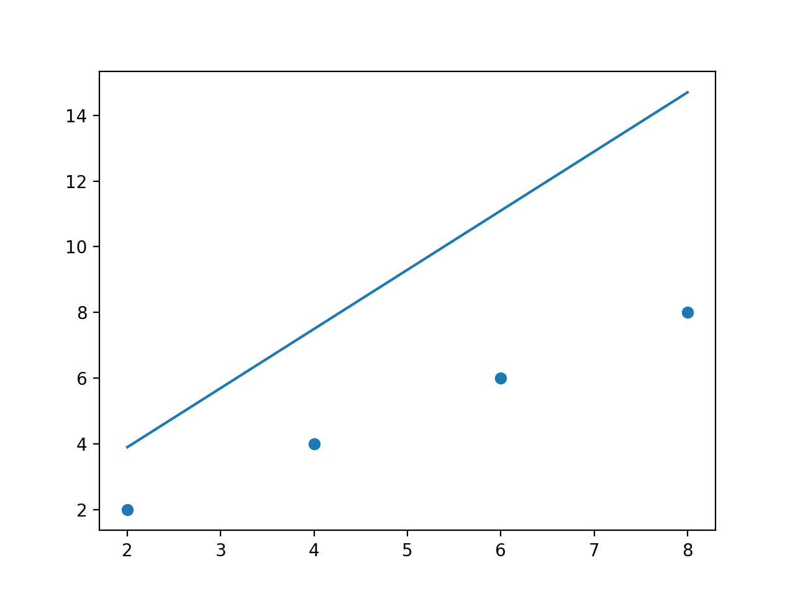
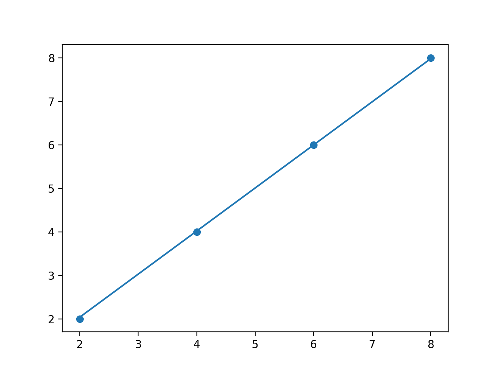
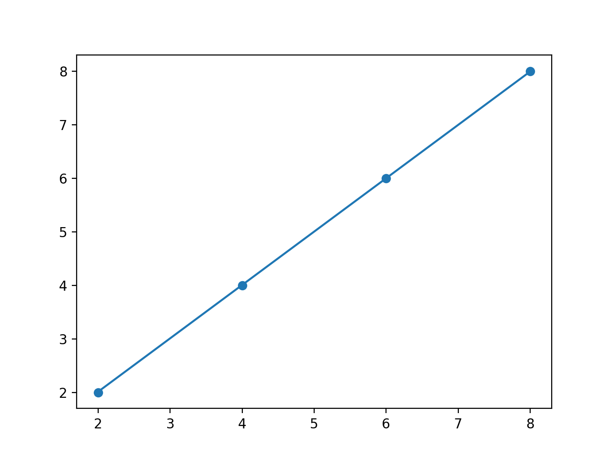
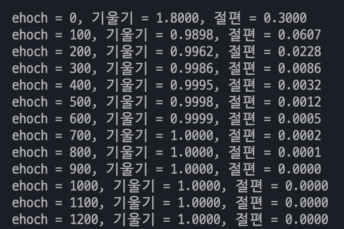

# 경사 하강법
    - 모델의 정확도를 높이기 위해 사용되는 방법으로 학습 중 발생하는 오차를 줄인다. 학습마다 기울기를 갱신하여 기울기가 최소값이 되는 부분을 찾는 것이다. 즉, 값들을 최대한 정확하게 분류할 수 있는 최적의 기준선을 찾는 과정이다. 아래 그래프는 경사 항강법을 적용했을 때 오차를 줄여가는 과정을 나타내는 그래프이다.

## 초기 기울기

## 기울기 갱신 (1)

## 기울기 갱신 (2)

## 2000번의 학습 중 갱신된 기울기 수치

    - 위와 같이 기울기를 갱신하여 모델의 정확도를 높인다.